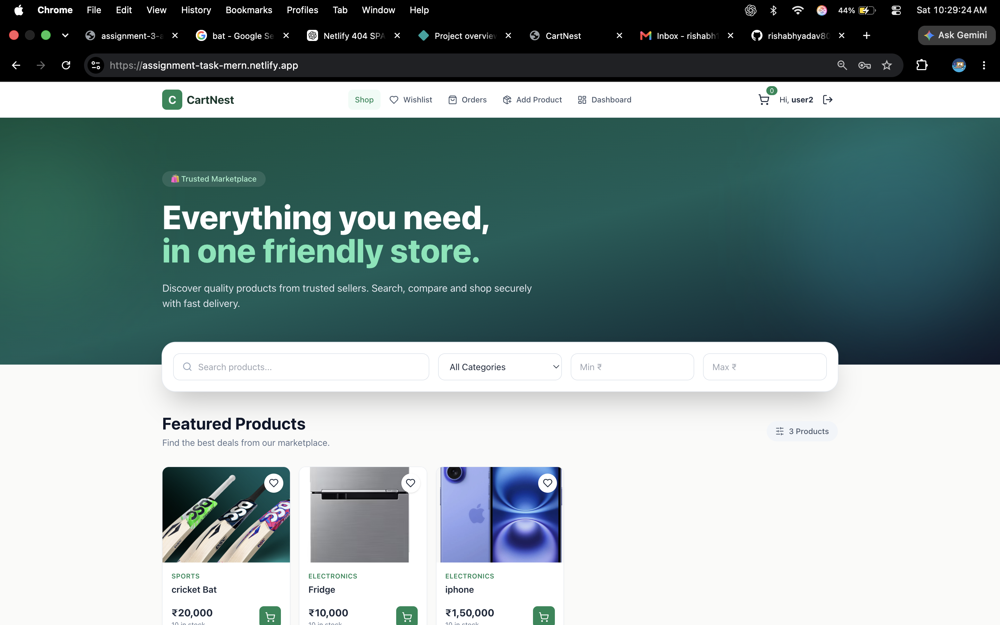
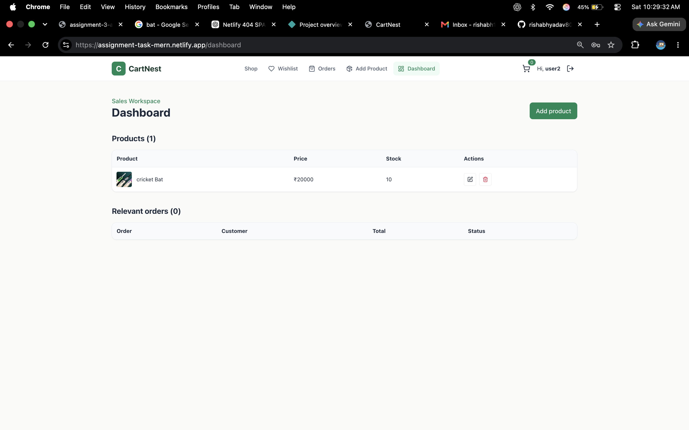
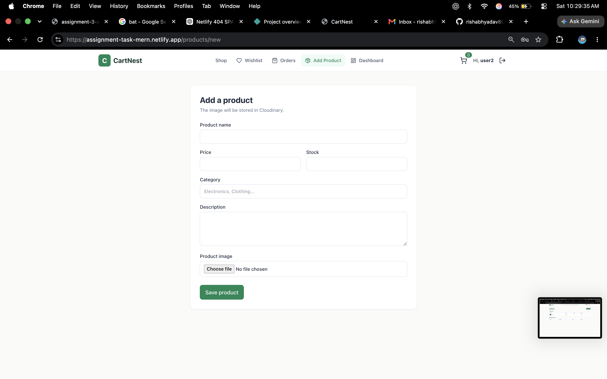
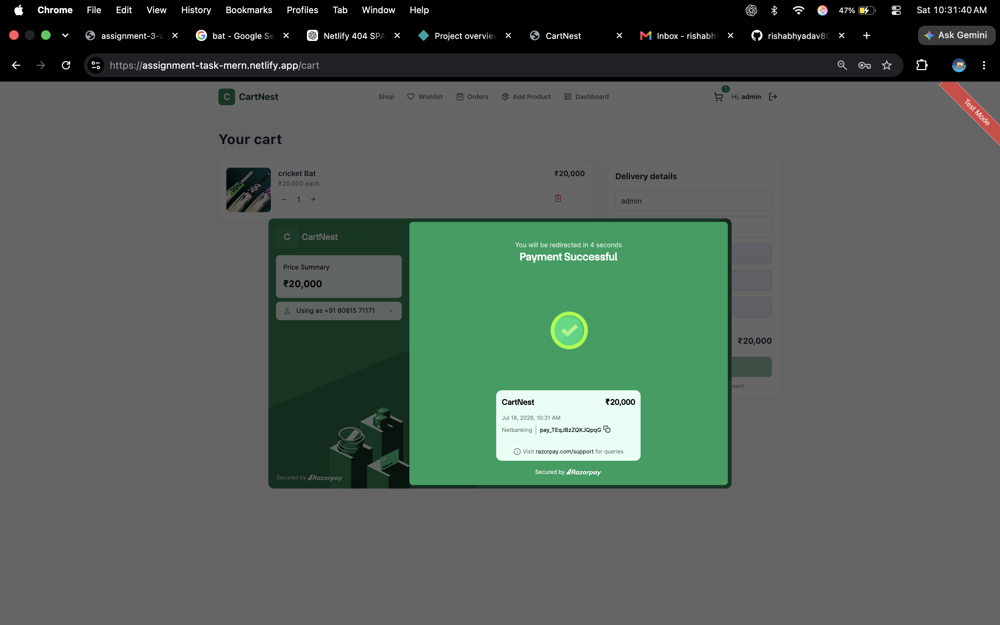
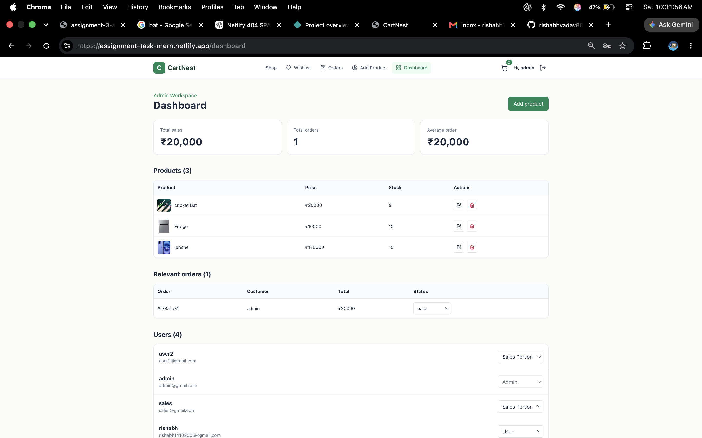

# CartNest

CartNest is a role-based e-commerce application built using the MERN stack. It supports three user roles: Admin, Sales Person, and Customer.

## Tech Stack

### Frontend

- React
- Vite
- Tailwind CSS
- Axios
- React Router

### Backend

- Node.js
- Express.js
- MongoDB
- Mongoose
- JWT authentication
- bcryptjs

### Services

- Cloudinary for product images
- Razorpay for test payments
- Render for backend hosting
- Netlify for frontend hosting
- MongoDB Atlas for the production database

## Features

### Customer

- Register and login
- Browse products
- Search and filter products
- Add products to wishlist
- Add products to cart
- Update cart quantities
- Complete payments using Razorpay test mode
- View order history

### Sales Person

- Add products
- Edit their own products
- Delete their own products
- View orders containing their products

### Admin

- Manage all products
- Manage users and their roles
- View all orders
- Update order status
- View sales statistics

Role permissions are checked on the backend.

## Project Structure

```text
cartnest/
├── backend/
│   ├── src/
│   │   ├── config/
│   │   ├── controllers/
│   │   ├── middleware/
│   │   ├── models/
│   │   ├── routes/
│   │   └── server.js
│   ├── .env.example
│   └── package.json
├── frontend/
│   ├── public/
│   ├── src/
│   │   ├── api/
│   │   ├── components/
│   │   ├── context/
│   │   └── pages/
│   └── package.json
└── README.md
```

## Local Setup

### Requirements

Install the following before running the project:

- Node.js 20 or later
- MongoDB Community Server
- Git

### Clone the Repository

```bash
git clone https://github.com/rishabhyadav8081/Assignment.git
cd Assignment
```

### Install Dependencies

```bash
npm install
npm run install:all
```

### Backend Environment Variables

Create `backend/.env` and add:

```env
PORT=5001
MONGODB_URI=mongodb://localhost:27017/task

JWT_SECRET=your_jwt_secret
JWT_EXPIRE=7d
NODE_ENV=development

FRONTEND_URL=http://localhost:5173

CLOUDINARY_CLOUD_NAME=your_cloudinary_cloud_name
CLOUDINARY_API_KEY=your_cloudinary_api_key
CLOUDINARY_API_SECRET=your_cloudinary_api_secret

RAZORPAY_KEY_ID=your_razorpay_test_key
RAZORPAY_KEY_SECRET=your_razorpay_test_secret
```

### Frontend Environment Variables

Create `frontend/.env` and add:

```env
VITE_API_URL=http://localhost:5001/api
```

### Run the Project

Run both frontend and backend:

```bash
npm run dev
```

Local URLs:

```text
Frontend: http://localhost:5173
Backend: http://localhost:5001
Health check: http://localhost:5001/api/health
```

## Test Credentials

### Admin

```text
Email: admin@gmail.com
Password: admin123
```

### Sales Person

```text
Email: sales@gmail.com
Password: sales123
```

Customers can create an account using the registration page.

## Production URLs

```text
Frontend: https://assignment-task-mern.netlify.app
Backend: https://assignment-3-a4ms.onrender.com
Health check: https://assignment-3-a4ms.onrender.com/api/health
```

## Deployment

### Backend — Render

Use the following settings:

```text
Root directory: backend
Build command: npm install
Start command: npm start
```

Add all backend environment variables through the Render dashboard.

For production, use:

```env
NODE_ENV=production
FRONTEND_URL=https://assignment-task-mern.netlify.app
MONGODB_URI=your_mongodb_atlas_connection_string
```

### Frontend — Netlify

Use:

```text
Base directory: frontend
Build command: npm run build
Publish directory: dist
```

Add this environment variable:

```env
VITE_API_URL=https://assignment-3-a4ms.onrender.com/api
```

The `frontend/public/_redirects` file should contain:

```text
/* /index.html 200
```

## API Routes

```text
/api/auth
/api/products
/api/cart
/api/wishlist
/api/orders
/api/users
```

## Notes

- Razorpay is configured in test mode.
- Product images are stored in Cloudinary.
- Passwords are hashed before being stored.
- JWT is used for authentication.
- Environment files are excluded from Git.
- Render free services may take some time to start after being inactive.

- 









